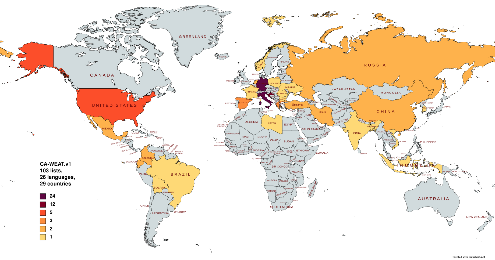
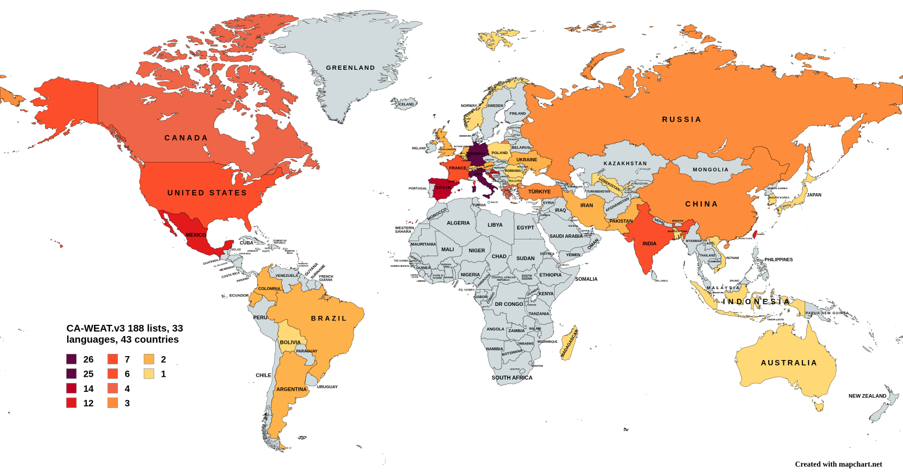

# CA-WEAT, Cultural Aware Word Embedding Association Tests

This repository contains the data and scripts necessary to reproduce the experiments in 

Cristina España-Bonet and Alberto Barrón-Cedeño. 2022. [The (Undesired) Attenuation of Human Biases by Multilinguality](https://aclanthology.org/2022.emnlp-main.133/). In Proceedings of the 2022 Conference on Empirical Methods in Natural Language Processing, pages 2056–2077, Abu Dhabi, United Arab Emirates. Association for Computational Linguistics.

(bibtex at the bottom)

## CA-WEATs

Word embedding association tests (WEAT) are made of lists of items and attributes that are related to the concepts used in implicit association tests (IAT) in social psychology. In this work we focus on (universal) non-social tests: IAT1 (flowers and insects vs pleasant and unpleasant attributes) and IAT2 (musical instruments and weapons vs pleasant and unpleasant attributes). IAT results show human positive biases towards flowers and musical instruments.

CA-WEAT is the cultural aware version of the English WEAT lists, where lists are generated from scratch for every new language by native speakers therefore preserving cultural differences among languages.

The folder ```data``` in this repo contains the tsv files with the cultural aware lists for WEAT1 and WEAT2 in 26 languages:
```ar```, 
```bg```, 
```bn```, 
```ca```, 
```de```, 
```el```, 
```en```, 
```es```, 
```fa```, 
```fr```, 
```hr```, 
```id```, 
```it```, 
```ko```, 
```lb```, 
```mr```, 
```nl```, 
```no```, 
```pl```, 
```pt```, 
```ro```, 
```ru```, 
```tr```, 
```uk```, 
```vi```, 
```zh```. Different variants are included in the dataset (e.g., Spanish from Mexico, Bolivia, Spain...). The geographical distribution is represented in the following map: 

<p align="center">
  
</p>

### Collaboration

If you see your home in grey, yellow, orange... we would highly appreciate your contribution for the next CA-WEAT dataset. If your country is colored in purple, don't be shy, we appreciate the data anyway :-). You'll find the form to submit new CA-WEAT lists and the instructions in several languages: [Catalan](https://docs.google.com/forms/d/e/1FAIpQLSfuCtPWl6MgpnitOLWbbncslIVE9ggY1HcezkPwmOvTu9R7SQ/viewform?usp=sf_link), [English](https://docs.google.com/forms/d/e/1FAIpQLSe7PxnTNox-TYTQZFz0S6j0XNv_fcZIg6RgZdOURveKIKs9Pw/viewform?usp=sf_link), [French](https://docs.google.com/forms/d/e/1FAIpQLSeyOaVTzNlpcIhWvbHLisX7VO72Gr3PL7K5gnFLKzDDimLGag/viewform?usp=sf_link), [German](https://docs.google.com/forms/d/e/1FAIpQLSeLsN2u8NWS-glF91uyMpE6UooyiZtfM_yB0c0AmolUsxYrBA/viewform?usp=sf_link), [Italian](https://docs.google.com/forms/d/e/1FAIpQLScFcw_ORqR9NwSzL3jY3s18e4Z2hEBNCbZjSgEhewmOymvIHA/viewform?usp=sf_link) and [Spanish](https://docs.google.com/forms/d/e/1FAIpQLSciZNJr-xxk-W4lvCc5Ja_BixdWy68doagOKmhJx7VmZILyaw/viewform?usp=sf_link). Whatever form you chose, you need to add the words in your mother tongue. If you are here you know about NLP... please, don't use named entities or words that are ambiguous, especially if they coincide with a stop word!

Thanks to your help we currently have almost 200 lists:
<p align="center">
  
</p>

## Bias and Size Effect

The calculation of the statistic and size effect has been adapted from [Lauscher and Glavas (SEM* 2019)](https://github.com/umanlp/XWEAT). 

Script ```runCaweat.sh``` can be used to specify the languages to consider (LANG column in the [CA-WEAT file](data/CA-WEATv1.tsv)) and the embedding model. Feel free to change the number of permutations to calculate p-values or the number of bootstraps for confidence intervals. Use flag ```--lower``` if the embedding model has the vocabulary lowercased.

### Tables and Plots

The results for the 16 embedding models and the 91 lists reported in the paper are collected in ```plots/collectedData.csv```. The script ```plots/plotCollectedData.py``` can be used to generate the plots and tables in a straightforward manner. 

## Citation

Please, use the following bibtex entry when citing this research work

```
@inproceedings{espana-bonet-barron-cedeno-2022-undesired,
    title = "The (Undesired) Attenuation of Human Biases by Multilinguality",
    author = "Espa{\~n}a-Bonet, Cristina  and Barr{\'o}n-Cede{\~n}o, Alberto",
    booktitle = "Proceedings of the 2022 Conference on Empirical Methods in Natural Language Processing",
    month = dec,
    year = "2022",
    address = "Abu Dhabi, United Arab Emirates",
    publisher = "Association for Computational Linguistics",
    url = "https://aclanthology.org/2022.emnlp-main.133",
    pages = "2056--2077"
}
```
